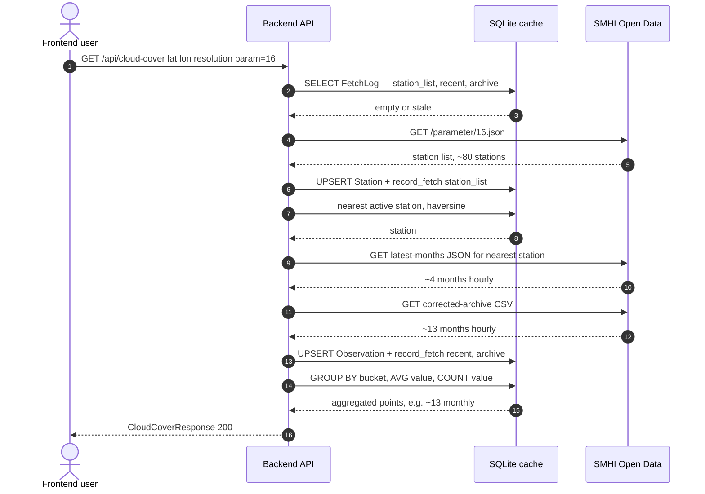
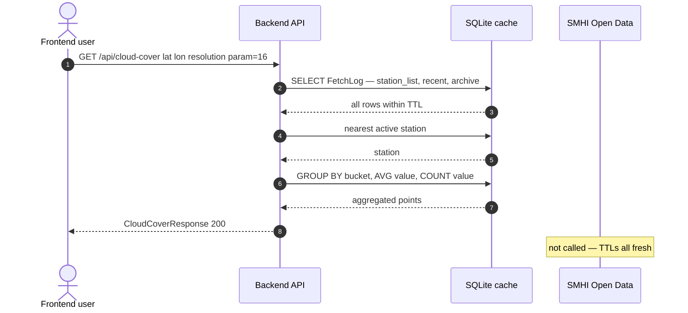
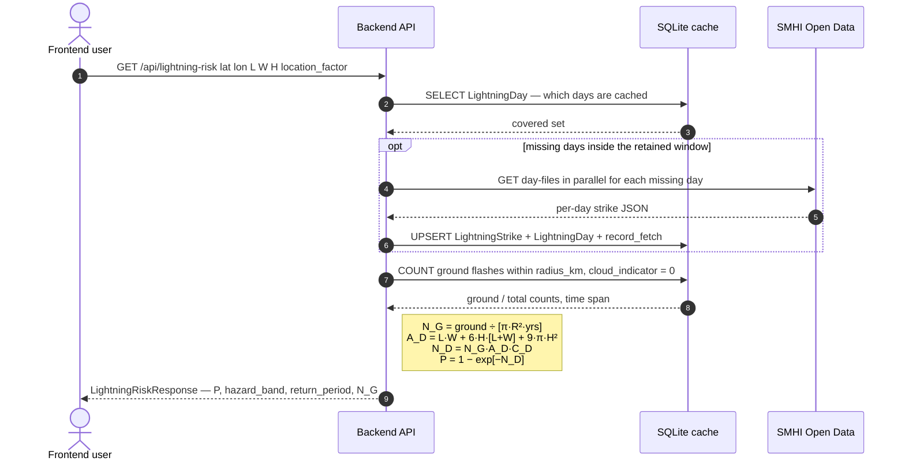

# meteo-map-lab

React + TypeScript frontend and FastAPI backend that uses SMHI data to analyze cloud coverage and lightning-strike probability for a location. See the brief in `README-instructions.md`.

[Deployed live here at GCP](https://meteo-map-lab-frontend-nbljv5sxtq-lz.a.run.app/)

## Prerequisites

- Docker + Docker Compose v2
- A MapTiler API key — https://cloud.maptiler.com/account/keys/

## Setup

```bash
cp frontend/.env.example frontend/.env   # set VITE_MAPTILER_KEY
cp backend/.env.example backend/.env     # optional; defaults are fine
```

## Run

Edit on the host (where you have git, your shell, your editor); the compose
stack runs the backend and frontend dev servers in containers:

```bash
make up          # docker compose up --build
```

- Frontend: http://localhost:5173
- Backend API: http://localhost:8000 (docs at /docs)

The repo is bind-mounted into both containers, so saves on the host trigger
Uvicorn `--reload` and Vite HMR — no rebuild needed for normal code changes.

> Ports 5173 and 8000 must be free on the host. If another dev server is using
> 5173, stop it first (or `make up` will fail to bind).

> Not set up for VS Code "Reopen in Container" — the runtime images are slim
> (no git, no editor tooling). Edit on the host instead.

The lightning endpoints (`/api/lightning`, `/api/lightning-risk`) lazily fetch
national strike day-files from SMHI on first request and return 503 until the
cache holds data. To warm it up front (up to ~12 months):

```bash
make ingest-lightning
```

## API

Interactive docs are at http://localhost:8000/docs. The endpoints:

| Method & path                                   | Purpose                                                                                                         |
| ----------------------------------------------- | --------------------------------------------------------------------------------------------------------------- |
| `GET /health`                                   | Liveness and backend status.                                                                                    |
| `GET /api/cloud-cover`                          | Cloud-cover series for one `param` (16 = total %, 29 = low cloud octas) at `resolution` = hourly/daily/monthly. |
| `GET /api/cloud-cover/combined`                 | Total % and low-cloud octas together, for the dual-axis chart.                                                  |
| `GET /api/lightning`                            | Strike counts near a point over the retained window.                                                            |
| `GET /api/lightning-risk`                       | IEC 62305 direct-strike probability for a structure (see below).                                                |
| `DELETE /api/cache?scope=all\|cloud\|lightning` | Purge cached SMHI data; returns per-table delete counts.                                                        |

All data endpoints take `lat` and `lon`, serve `stale: true` from cache when
SMHI is unreachable, and 503 when nothing is cached.

## Tests

With the stack running (`make up` in another terminal):

```bash
make test        # backend pytest + frontend typecheck/lint
```

## Regenerating API types

The frontend's types are generated from the backend's OpenAPI schema:

```bash
make gen-api     # export backend/openapi.json, then regenerate
                 # frontend/src/lib/api-schema.d.ts
```

Run this after changing any route or response model, and commit the updated
`openapi.json` and `api-schema.d.ts`.

## How cloud-cover works

`GET /api/cloud-cover?lat=&lon=&resolution=&param=` is served by
`CloudCoverService`, which treats SMHI as the source of truth and a local
SQLite cache as the fast path. The cache has three tables: `Station`,
`Observation`, and `FetchLog`. The `FetchLog` ledger decides when SMHI is
hit at all. `param` (16 = total cloud cover %, 29 = low cloud octas) is part of
every key, so the same station holds independent rows per parameter.

**Scenario 1, cold cache start.** Fresh database, first request for a coordinate
runs the full ladder: station list → nearest station → recent JSON → archive CSV
→ SQL aggregation.



**Scenario 2, second go (cache hit).** All three `FetchLog` TTLs still fresh,
so SMHI isn't called. The whole request is three DB reads + one `GROUP BY`.



How each table is hit:

- **`Station`** the SMHI station catalog (per `param`). **Written** by
  `upsert_stations` whenever the station list is refreshed in step 1.
  **Read** in step 2 by `nearest_station`, which scans the active stations and
  returns the closest one within `nearest_max_km` (or 404 `NoStationFound`).
- **`Observation`** the cached time series, one row per
  `(param, station_id, ts_utc)` with `value` (native unit) and `quality`.
  **Written** by `upsert_observations` after a recent or archive fetch (step 3),
  using an `ON CONFLICT DO UPDATE` upsert. **Read** in step 4 by
  `aggregate_observations`, which buckets and means in SQL
  (`strftime('start of day' / 'start of month', …)` + `GROUP BY`) instead of
  hydrating rows into Python, keeps cached-read latency in the ~100 ms range
  on Cloud Run's 1 throttled vCPU.
- **`FetchLog`** the fetch ledger keyed by `(param, station_id, kind)`, the
  gatekeeper for every SMHI call. Three `kind`s: `station_list`
  (`station_id=0`), `recent`, and `archive`. **Read** at the top of steps 1
  and 3 to decide whether a fetch is due, the station list, `recent`, and
  `archive` rows each expire on their own TTL (`station_list_ttl_days`,
  `recent_ttl_seconds`, `archive_ttl_days`). **Written** by `record_fetch`
  after each attempt (including a 404 on `recent`, so the TTL is still
  honored).

If SMHI is unreachable but the cache already holds data, the response is served
from cache with `stale: true`; if there is no station list or no cached data at
all, the endpoint returns 503 `SMHIUnavailable`.

> The `LightningStrike` and `LightningDay` tables are not part of this path,
> they back the separate lightning-strike feature.

## How strike risk works

`GET /api/lightning-risk?lat=&lon=&length_m=&width_m=&height_m=&location_factor=&line_length_m=`
estimates the IEC 62305 chance of a direct lightning strike to a structure at a
point. It reuses the cached lightning strikes (the lightning feature above) to
derive a _local_ ground flash density, then applies the standard collection-area
formulas. The math lives in the pure, I/O-free module
`backend/app/services/lightning_risk.py`.

**Scenario 3, lightning risk assessment.** Strikes are cached per-day, so the
shape is "warm the day-file cache, then do the math." After `make
ingest-lightning` (or the first user click, whichever came first) the SMHI lane
is silent and the response is sub-second.



1. **Ground flash density `N_G`** — `LightningService.ground_flash_density`
   counts cached **ground** flashes (`cloud_indicator == 0`) within
   `lightning_radius_km` of the point and annualizes over the retained window:
   `N_G = ground_flashes / (π·R²) / span_years` (flashes/km²/yr). Cloud flashes
   are excluded; `N_G = 0` is valid and yields zero risk.
2. **Collection areas** — structure `A_D = L·W + 6H(L+W) + 9πH²`; optional
   incoming line `A_L = 40·L_c` (computed in m², converted to km²).
3. **Expected annual events** — direct strikes `N_D = N_G·A_D·C_D`, where `C_D`
   is the IEC location factor (0.25 surrounded by taller objects, 0.5
   equal/lower height, 1.0 isolated, 2.0 isolated hilltop); line strikes
   `N_L = N_G·A_L`.
4. **Probability** — annual chance of at least one direct strike
   `P = 1 − exp(−N_D)` (Poisson), with a return period `1/N_D` ("≈ 1 in X
   years").

The response also carries a `hazard_band` (Very low / Low / Moderate / High).
**This band is a presentational heuristic, not an IEC 62305 R1 compliance
verdict** — the endpoint deliberately stops short of the full risk assessment
(probability-of-damage and loss factors, tolerable-risk thresholds). Like the
other endpoints it serves `stale: true` from cache when SMHI is unreachable, or
503 when nothing is cached. See the design at
`docs/superpowers/specs/2026-06-02-lightning-strike-risk-design.md`.

## Known limitations

- **Quality-correction handoff.** SMHI serves recent data under `latest-months`
  (uncorrected) and quality-controls it into `corrected-archive` only after it
  ages out, months later. The backend caches the uncorrected `latest-months`
  value when it first sees an observation. To eventually fold in the corrected
  value it re-fetches the archive on a TTL (`archive_ttl_days`, default 30) and
  upserts over the existing rows. With the TTL shorter than SMHI's correction
  lag, served values converge on the corrected ones within roughly a month of
  publication, but there is still a window where a recently-aged observation
  carries its uncorrected value. SMHI's exact `corrected-archive` regeneration
  cadence has not been verified against their docs; if it turns out to be
  slower or faster than ~monthly, tune `archive_ttl_days` accordingly.
- **Sparse param-16 coverage.** Active total-cloud-cover (param 16) stations are
  sparse — manual cloud observations are being phased out — so the nearest
  station can be far from the requested coordinate (hence the wide
  `nearest_max_km` default of 250 km). Param 29 (low cloud, octas) has denser
  coverage.

## Deployment

Production runs on GCP: two Cloud Run services in `europe-north1`, SQLite
preserved on a tmpfs volume and replicated to GCS via Litestream,
Terraform-provisioned, deployed by GitHub Actions on push to `main`. The
one-time bootstrap module (Terraform state bucket + GitHub Workload Identity
pool) lives in `infra/bootstrap/`; the rest in `infra/main/`. Full design:
`docs/superpowers/specs/2026-06-01-gcp-cloud-run-litestream-deploy-design.md`.

GitHub repo secrets required for CI: `GCP_PROJECT_ID`, `GCP_WIF_PROVIDER`,
`GCP_CI_SA_EMAIL`, `MAPTILER_KEY`.

## Monitoring (production)

Quick links — bookmark these for the Cloud Run service dashboards:

- **Metrics** (request rate, p50/p95/p99 latency, CPU, memory, instance count):
  <https://console.cloud.google.com/run/detail/europe-north1/meteo-map-lab-backend/metrics?project=meteo-map-lab>
- **Logs** (searchable, filterable by severity):
  <https://console.cloud.google.com/run/detail/europe-north1/meteo-map-lab-backend/logs?project=meteo-map-lab>

Live-tail the backend's logs in your terminal:

```sh
make logs-prod            # everything
make logs-prod-errors     # only ERROR+ (5xx, tracebacks)
```

Both require `gcloud beta` once: `gcloud components install beta`.

### Tracking outbound calls to SMHI

The backend logs one structured line per outbound HTTP call (both the cloud
and lightning clients). In the Cloud Logging console:

```
jsonPayload.message="outbound_request"                         # all outbound calls
jsonPayload.message="outbound_request" AND jsonPayload.service="smhi-metobs"
jsonPayload.message="outbound_request" AND jsonPayload.status>=400
jsonPayload.message="outbound_request" AND jsonPayload.duration_ms>2000
```

For a count over time, create a **logs-based counter metric** (Logging →
Logs-based metrics → Create metric) using the same filter, then chart it in
Cloud Monitoring or alert on a threshold (e.g. "more than 100 outbound
calls in 5 min" — usually means the cache emptied).

### Trace correlation

Every inbound request, the matching `request_complete` log line, and any
`outbound_request` lines it spawns all carry the same Cloud Trace ID
(stashed in a `contextvars.ContextVar` from the inbound
`X-Cloud-Trace-Context` header). In Cloud Logging, opening one entry
reveals all related entries grouped under that trace — useful when chasing
a single slow request through to the SMHI calls it made.

### Cleaner dashboard filters

Cloud Run emits its own per-request `http_request` entry alongside our
structured ones; the duplicate is informational only. For day-to-day
debugging, filter the noise out:

```
jsonPayload.message=("request_complete" OR "outbound_request")
```

Save it as a Cloud Logging "Saved query" and pin it to the project — gives
you the structured stream without Cloud Run's chatter.

## Out of scope (later)

Horizontal backend scaling (incompatible with single-writer SQLite), a custom
domain, and AI forecasting.
