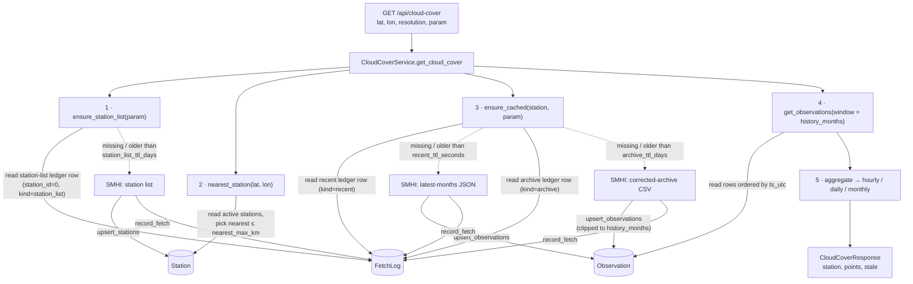

# meteo-map-lab

React + TypeScript frontend and FastAPI backend that uses SMHI data to analyze
cloud coverage and lightning-strike probability for a location. See the brief in
`README-instructions.md` and architecture in `ai-docs/PLANNING.md`.

## Prerequisites

- Docker + Docker Compose v2
- A MapTiler API key — https://cloud.maptiler.com/account/keys/

## Setup

```bash
cp frontend/.env.example frontend/.env   # set VITE_MAPTILER_KEY
cp backend/.env.example backend/.env     # optional; defaults are fine
```

## Run

Edit on the host (where you have git, your shell, your editor); the compose
stack runs the backend and frontend dev servers in containers:

```bash
make up          # docker compose up --build
```

- Frontend: http://localhost:5173
- Backend API: http://localhost:8000 (docs at /docs)

The repo is bind-mounted into both containers, so saves on the host trigger
Uvicorn `--reload` and Vite HMR — no rebuild needed for normal code changes.

> Ports 5173 and 8000 must be free on the host. If another dev server is using
> 5173, stop it first (or `make up` will fail to bind).

> Not set up for VS Code "Reopen in Container" — the runtime images are slim
> (no git, no editor tooling). Edit on the host instead.

The lightning endpoints (`/api/lightning`, `/api/lightning-risk`) lazily fetch
national strike day-files from SMHI on first request and return 503 until the
cache holds data. To warm it up front (up to ~12 months):

```bash
make ingest-lightning
```

## API

Interactive docs are at http://localhost:8000/docs. The endpoints:

| Method & path | Purpose |
| --- | --- |
| `GET /health` | Liveness and backend status. |
| `GET /api/cloud-cover` | Cloud-cover series for one `param` (16 = total %, 29 = low cloud octas) at `resolution` = hourly/daily/monthly. |
| `GET /api/cloud-cover/combined` | Total % and low-cloud octas together, for the dual-axis chart. |
| `GET /api/lightning` | Strike counts near a point over the retained window. |
| `GET /api/lightning-risk` | IEC 62305 direct-strike probability for a structure (see below). |
| `DELETE /api/cache?scope=all\|cloud\|lightning` | Purge cached SMHI data; returns per-table delete counts. |

All data endpoints take `lat` and `lon`, serve `stale: true` from cache when
SMHI is unreachable, and 503 when nothing is cached.

## Tests

With the stack running (`make up` in another terminal):

```bash
make test        # backend pytest + frontend typecheck/lint
```

## Regenerating API types

The frontend's types are generated from the backend's OpenAPI schema:

```bash
make gen-api     # export backend/openapi.json, then regenerate
                 # frontend/src/lib/api-schema.d.ts
```

Run this after changing any route or response model, and commit the updated
`openapi.json` and `api-schema.d.ts`.

## How cloud-cover works

`GET /api/cloud-cover?lat=&lon=&resolution=&param=` is served by
`CloudCoverService`, which treats SMHI as the source of truth and a local
SQLite cache as the fast path. The cache has three tables — `Station`,
`Observation`, and `FetchLog` — and the `FetchLog` ledger decides when SMHI is
hit at all. `param` (16 = total cloud cover %, 29 = low cloud octas) is part of
every key, so the same station holds independent rows per parameter.



How each table is hit:

- **`Station`** — the SMHI station catalog (per `param`). **Written** by
  `upsert_stations` whenever the station list is refreshed in step 1.
  **Read** in step 2 by `nearest_station`, which scans the active stations and
  returns the closest one within `nearest_max_km` (or 404 `NoStationFound`).
- **`Observation`** — the cached time series, one row per
  `(param, station_id, ts_utc)` with `value` (native unit) and `quality`.
  **Written** by `upsert_observations` after a recent or archive fetch (step 3),
  using an `ON CONFLICT DO UPDATE` upsert. **Read** in step 4 by
  `get_observations` for the `history_months` window, then aggregated and
  returned.
- **`FetchLog`** — the fetch ledger keyed by `(param, station_id, kind)`, the
  gatekeeper for every SMHI call. Three `kind`s: `station_list`
  (`station_id=0`), `recent`, and `archive`. **Read** at the top of steps 1
  and 3 to decide whether a fetch is due — the station list, `recent`, and
  `archive` rows each expire on their own TTL (`station_list_ttl_days`,
  `recent_ttl_seconds`, `archive_ttl_days`). **Written** by `record_fetch`
  after each attempt (including a 404 on `recent`, so the TTL is still
  honored).

If SMHI is unreachable but the cache already holds data, the response is served
from cache with `stale: true`; if there is no station list or no cached data at
all, the endpoint returns 503 `SMHIUnavailable`.

> The `LightningStrike` and `LightningDay` tables are not part of this path —
> they back the separate lightning-strike feature.

## How strike risk works

`GET /api/lightning-risk?lat=&lon=&length_m=&width_m=&height_m=&location_factor=&line_length_m=`
estimates the IEC 62305 chance of a direct lightning strike to a structure at a
point. It reuses the cached lightning strikes (the lightning feature above) to
derive a *local* ground flash density, then applies the standard collection-area
formulas. The math lives in the pure, I/O-free module
`backend/app/services/lightning_risk.py`.

1. **Ground flash density `N_G`** — `LightningService.ground_flash_density`
   counts cached **ground** flashes (`cloud_indicator == 0`) within
   `lightning_radius_km` of the point and annualizes over the retained window:
   `N_G = ground_flashes / (π·R²) / span_years` (flashes/km²/yr). Cloud flashes
   are excluded; `N_G = 0` is valid and yields zero risk.
2. **Collection areas** — structure `A_D = L·W + 6H(L+W) + 9πH²`; optional
   incoming line `A_L = 40·L_c` (computed in m², converted to km²).
3. **Expected annual events** — direct strikes `N_D = N_G·A_D·C_D`, where `C_D`
   is the IEC location factor (0.25 surrounded by taller objects, 0.5
   equal/lower height, 1.0 isolated, 2.0 isolated hilltop); line strikes
   `N_L = N_G·A_L`.
4. **Probability** — annual chance of at least one direct strike
   `P = 1 − exp(−N_D)` (Poisson), with a return period `1/N_D` ("≈ 1 in X
   years").

The response also carries a `hazard_band` (Very low / Low / Moderate / High).
**This band is a presentational heuristic, not an IEC 62305 R1 compliance
verdict** — the endpoint deliberately stops short of the full risk assessment
(probability-of-damage and loss factors, tolerable-risk thresholds). Like the
other endpoints it serves `stale: true` from cache when SMHI is unreachable, or
503 when nothing is cached. See the design at
`docs/superpowers/specs/2026-06-02-lightning-strike-risk-design.md`.

## Known limitations

- **Quality-correction handoff.** SMHI serves recent data under `latest-months`
  (uncorrected) and quality-controls it into `corrected-archive` only after it
  ages out, months later. The backend caches the uncorrected `latest-months`
  value when it first sees an observation. To eventually fold in the corrected
  value it re-fetches the archive on a TTL (`archive_ttl_days`, default 30) and
  upserts over the existing rows. With the TTL shorter than SMHI's correction
  lag, served values converge on the corrected ones within roughly a month of
  publication — but there is still a window where a recently-aged observation
  carries its uncorrected value. SMHI's exact `corrected-archive` regeneration
  cadence has not been verified against their docs; if it turns out to be
  slower or faster than ~monthly, tune `archive_ttl_days` accordingly.
- **Sparse param-16 coverage.** Active total-cloud-cover (param 16) stations are
  sparse — manual cloud observations are being phased out — so the nearest
  station can be far from the requested coordinate (hence the wide
  `nearest_max_km` default of 250 km). Param 29 (low cloud, octas) has denser
  coverage.

## Deployment

A production deployment on GCP (Cloud Run for both services, SQLite preserved
at runtime and replicated to GCS via Litestream, Terraform-provisioned, deployed
by GitHub Actions) is designed but not yet fully wired up. The one-time
bootstrap module that creates the Terraform state bucket and the GitHub Workload
Identity Federation pool lives in `infra/bootstrap/`; the full design is in
`docs/superpowers/specs/2026-06-01-gcp-cloud-run-litestream-deploy-design.md`.

## Out of scope (later)

CI/CD pipelines (designed in the deploy spec above, not yet implemented),
horizontal backend scaling (incompatible with single-writer SQLite), a custom
domain, and AI forecasting.
